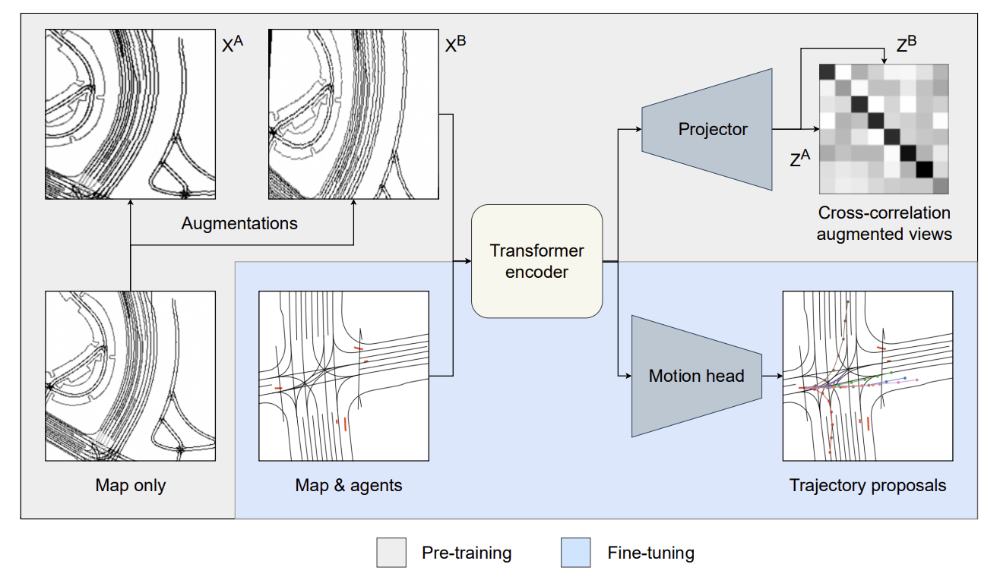

# Road Barlow Twins: Redundancy Reduction for Motion Prediction
TL;DR: New self-supervised learning method for motion prediction in self-driving applications.

## Overview

Road Barlow Twins. During pre-training, plain map data is used. 
The pre-training objective is to learn similar embeddings for differently augmented views of the same map data. During fine-tuning, annotated samples with past traffic agent trajectories are used to fine-tune for motion prediction.

## Follow-up work
We continued this work with a focus on learned token set representations instead of rasterized image representations in this [repository fork](https://github.com/KIT-MRT/red-motion).  

## Prepare waymo open motion prediction dataset
Register and download the dataset from [here](https://waymo.com/open).
Clone [this repo](https://github.com/kbrodt/waymo-motion-prediction-2021) and use the prerender script as described in the readme.

## Acknowledgements
The local attention ([Beltagy et al., 2020](https://arxiv.org/abs/2004.05150)) and cross-attention ([Chen et al., 2021](https://arxiv.org/abs/2103.14899)) implementations are from lucidrain's [vit_pytorch](https://github.com/lucidrains/vit-pytorch) library.
The baseline DualMotionViT model builds upon the work by [Konev et al., 2022](https://arxiv.org/abs/2206.02163).
