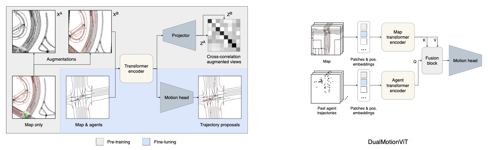

## Road Barlow Twins
Self-supervised pre-training method for HD map assisted motion prediction.

### Overview


Left: Pre-training and fine-tuning objectives. Pre-training: Maximize the similarity of moderately augmented views of HD maps. Fine-tuning: Motion prediction with six trajectory proposals per agent.

Right: Proposed DNN model for motion prediction with seperate encoders for map data and past agent trajectories.

### Getting started
```python
# cd src/road_barlow_twins
import timm
from models.dual_motion_vit import DualMotionViT

map_encoder = timm.create_model(
    "vit_base_patch16_224",
    pretrained=False,
    in_chans=3,
    num_classes=1_000,  # can be random
)

agent_encoder = timm.create_model(
    "vit_base_patch16_224",
    pretrained=False,
    in_chans=22,
    num_classes=1_000,  # can be random
)

motion_model = DualMotionViT(
    map_encoder,
    agent_encoder,
    map_encoder_dim=768,
    agent_encoder_dim=768,
    fusion_depth=2, # Number of cross-attention layers for fusion
    n_traj=6, # Number of trajectory proposals
    time_limit=50, # Predict 50ms
    lr=1e-4,
)

```
