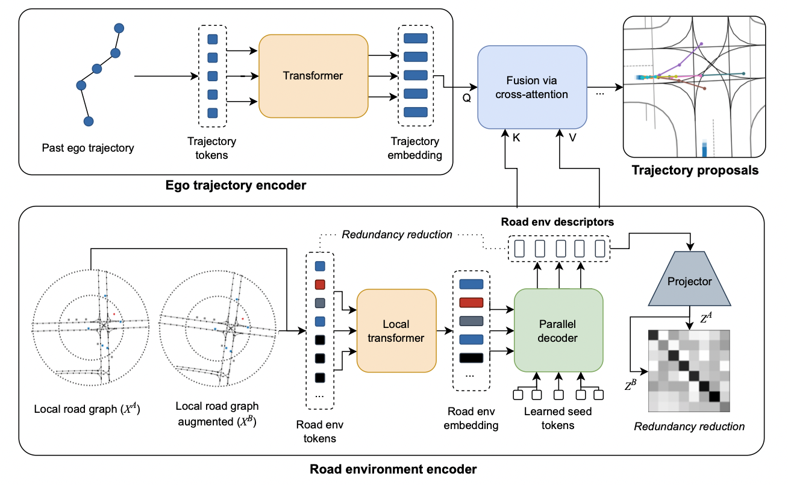

# Road Barlow Twins
Self-supervised pre-training method for HD map assisted motion prediction.

## Overview

REDMotion model. Our model consists of two encoders. The ego trajectory encoder generates an embedding for the past trajectory of the ego agent. The road environment encoder generates a set of road environment descriptors as context embedding. Both embeddings are fused via cross-attention to yield trajectory proposals per agent.

## Getting started  

Open the Colab notebook above for a demo of our REDMotion model. The demo shows how to create a dataset, run inference, and visualize the predicted trajectories.

## Prepare waymo open motion prediction dataset
Register and download the dataset from [here](https://waymo.com/open).
Clone [this repo](https://github.com/kbrodt/waymo-motion-prediction-2021) and use the prerender script as described in the readme.

### Acknowledgement
The code in this repo builds up-on the work by [Konev et al.](https://arxiv.org/abs/2206.02163).
